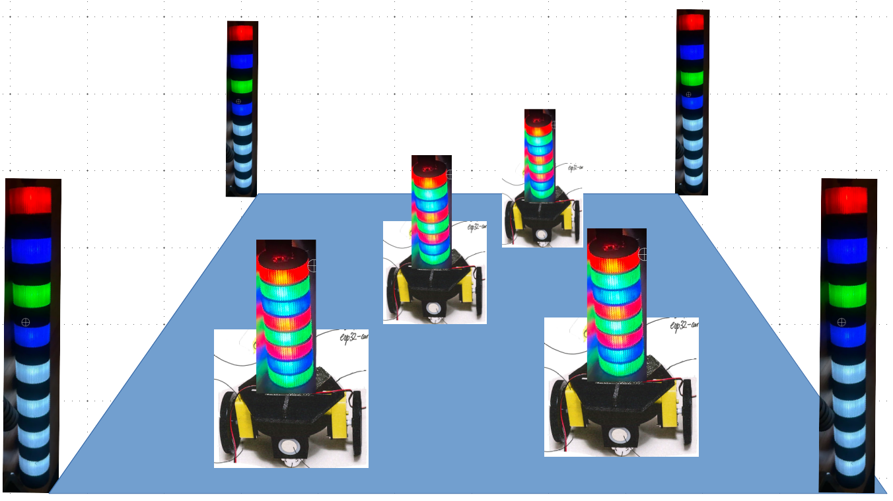

# ChromaVertex Swarm: Experiments in Robot Cooperation

  

ChromaVertex is a community hobby project focused on cooperative robot networks. 

As members of the *Deep Dive Guild* at [Melbourne TechGuilds](https://techguilds.au/), we are building inexpensive VertexBots to explore swarm behaviour, computer vision, geometry, and distributed algorithms. Our aim is to create a shared platform where each person can assemble one or more robots, take them home, and continue developing algorithms between group sessions, not to compete with sophisticated research platforms, but to learn, experiment, and enjoy the journey together.

The project is intentionally low-cost (roughly $120 per robot in early estimates), and it supports different levels of involvement. You can explore as deeply as you like, from 3D printing and hardware assembly to image processing, sensor fusion, and distributed control algorithms.

This is not only about building a single robot. It is about building a common experimental ecosystem that enables both independent progress and collaborative swarm experiments.

## Design Concept: VertexBot

Each VertexBot is designed to observe its surroundings and detect other VertexBots.

When a robot detects another, it shares relative pose information with the group. With these exchanged observations, robots can apply trilateration and/or triangulation methods to estimate their own positions.

On top of localization, the robots can run formation-control behaviors to create coordinated group motion patterns.

We use [KiCad](https://www.kicad.org/) for VertexBot circuit designs, and those designs are available in the [VertexBot repository](https://github.com/patrickdiligent/VertexBot).

## Parts List

The VertexBot parts list is also available as an accessible Markdown table: [docs/system/vbot_parts.md](docs/system/vbot_parts.md).

